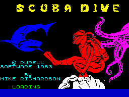

# spectrum-scubadive-rev
Reversing **Scuba Dive** game for ZX Spectrum, 1983 Durell Software.

Status: work in progress.

## Original



The original binary used for the disasm is .TAP file from [World of Spectrum](https://worldofspectrum.org/archive/software/games/scuba-dive-durell-software-ltd), 39428 bytes length.

.TAP file contains four blocks:
```
   Name         Type   Addr    Size  SizeHex   RangeHex
  "SCUBA     "  BASIC 
  "DIVE      "  CODE   16384,  7150   $1BEE   $4000-$5BED
  "S         "  CODE   24576, 25856   $6500   $6000-$C4FF
  "D         "  CODE   55552,  6144   $1800   $D900-$F0FF
```

## Spectrum 48K ROM usage

The BASIC loader code is the following:
```
1 CLEAR 24575: INK 0: PAPER 0: BORDER 1: CLS : LOAD ""CODE: PRINT AT 2,0;: LOAD ""CODE: PRINT AT 2,0;: LOAD ""CODE
2 IF USR 60895THEN SAVE "S/D SCORE"CODE 59866,160: GO TO 2
3 LOAD "S/D SCORE"CODE : GO TO 2
```
Line 1 loads the game binaries.
Line 2 starts the assemmbly code at 60895 ($EDDF); in the game menu user could press <KBD>S</KBD> to save score table, in this case we're returning from the assembly code and going to <code>THEN</code> on line 2.
Or, user could press <KBD>L</KBD> on the menu, and in this case we're going to line 3, loading the score table.
Anyway, after load or save we're returning to line 2 and re-entering the same starting point again.

The game code uses some ROM subroutines: to clear screen, print text on the screen, set border color, keyboard scan and sound generation. Also the code uses some system variables like <code>LAST-K</code> and <code>ATTR-P</code>. ROM font used in text output subroutines.


## The reversed code

The reversed code structure:
 - <code>basloader.bas</code> - text representation for the BASIC code used for game loading, and also for score table saving and loading
 - <code>scubacoda.asm</code> - block $4000-$5BED
   - <code>scubascrn.dat</code> - loading screen in raw binary format
 - <code>scubacodb.asm</code> - block $6000-$C4FF
   - <code>scubasprt.asm</code> - sprites $6000-$9C4F
   - <code>scubarelf.asm</code> - relief tiles and world mini-map
 - <code>scubacodc.asm</code> - block $D900-$F0FF

All three .asm code files are compiled with pasmo cross-assembler, and compared to original binary blocks byte-to-byte, no differences.


## The game map

The game labyrinth "warped up":
first, the AC5D table (the "mini-map") contains 32x32 = 1024 block indices;
second, blocks at A4DD contains 8x8 tiles each;
and finally, tiles at 9134 are 8x8 pixels each.<br>
So the whole world is 256x256 tiles = 2048x2048 pixels.
We always see only 24x24 tiles on the screen.

The game map created in a procedural way, changing block numbers in the AC5D table.
The map depth depends on the game level 1..4.

There's an interesting way to put a big Octopus on the map.
The Octopus always guarding a way leading down the map.
So when we need an Octopus, we just put blocks number $1C and $1D next to each other, and that's used as a placeholder for the Octopus.


## Tools for the `tools` folder

 - `bas2tap.exe`, `bin2tap.exe` utilities
   https://sourceforge.net/projects/zxspectrumutils/files/

 - `pasmo.exe` cross-assembler
   http://pasmo.speccy.org/


## Links

 - [Scuba Dive disasm in SkoolKit HTML](https://nzeemin.github.io/skoolkit-game-revs/scubadive-zx/scuba/)
 - [nzeemin/skoolkit-game-revs repo for some game disasm using SkoolKit](https://github.com/nzeemin/skoolkit-game-revs)
